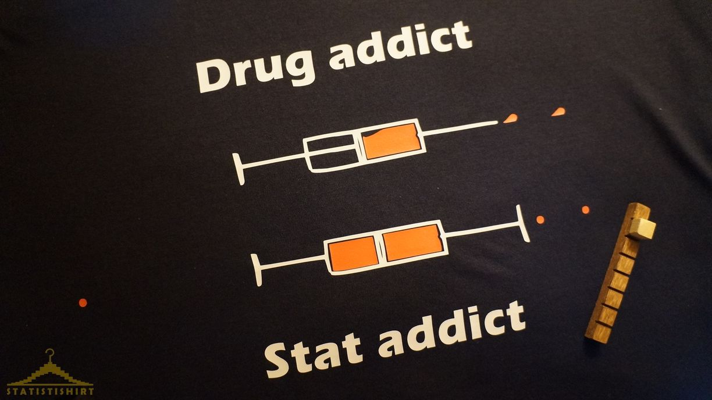

# statistishirt

Well, this is not - so to speak - a technical repository. It's more of an advertisement for one of my side projects that evolved into an actual online store! Here's the pitch:

Tired of seeing the same old T-shirts saying stuff like "I'm significant", "I'm an outlier" or "54% of all statistics are made up"? So were we...
STATISTISHIRT® (sorry for the name by the way, since I'm French I have no idea of how it sounds for a native English speaker) fills a gap in the universe of geeky T-shirts and tries to take a leap into somewhat more subtle messages and designs. All the ideas and designs are original, inspired from my years in statistics (that's why some T-shirts aim at correcting bad DataScience habits). Anyway, most of them will undoubtedly trigger a feeling of incomprehension in a random person: that's actually a good thing, take it as a convenient icebreaker to tell people about your real job.

So check out the products, they're all original and come from my crazy mind: [https://www.statistishirt.com/list-products](https://www.statistishirt.com/list-products)

Or the [full story of the products](https://www.statistishirt.com/our-story)

And for anyone who finds the name of all the famous statisticians present on the pictures of the Tshirts, They get a 20% discount!

